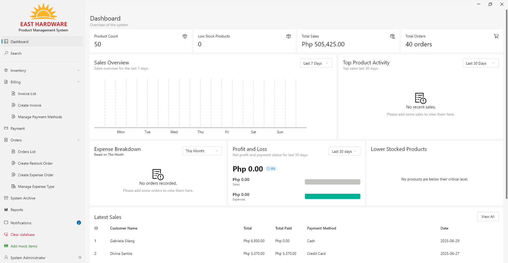
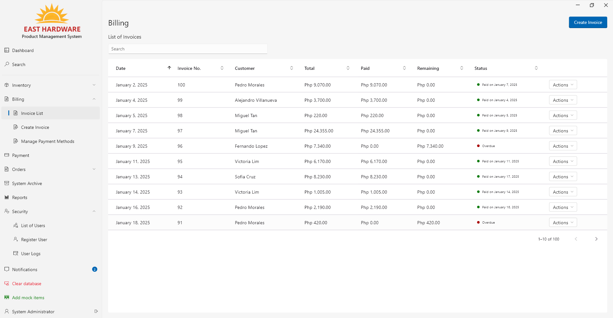
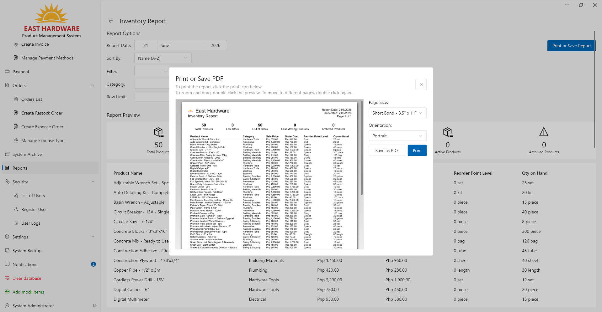

<!-- rank: 1 -->

Small-to-medium retail and hardware businesses often struggle to manage stock levels, sales invoices, and supplier orders across multiple local terminals without relying on expensive, complex cloud platforms or manual paperwork. To solve this, I designed and built a local-first, highly responsive, and secure Product Management System (PMS) that operates completely offline or synchronized across a Local Area Network (LAN), giving business owners complete control over their transactional data without subscription fees or external dependencies.

Built as a desktop application with Flutter and Fluent UI, the system leverages a distributed peer-to-peer/client-server architecture where a host device spawns background Dart Isolates to run concurrent HTTP and WebSocket shelf servers. Client terminals automatically discover the server on the subnetwork and establish secure connections using a custom asymmetric cryptographic handshake. All database operations are forwarded to the server through a JSON-serialized database proxy, which executes queries sequentially in an atomic queue to ensure complete concurrency control and real-time state synchronization across all client UIs.

### Tech Stack & Key Features

- **Distributed Local Syncing**: Uses Dart Isolates to run shelf-based HTTP/WebSocket servers on the host device. Client nodes scan subnets via `network_tools` and auto-connect to the server, enabling seamless local-network synchronization.
- **WebSocket Database Proxy**: Implements a custom `DatabaseServerProxy` matching the SQFlite `Database` API. All CRUD calls are serialized into JSON packets, sent over encrypted WebSockets, and executed sequentially via a thread-safe `AsyncQueue` to prevent database race conditions.
- **Predictive Inventory Analytics**: Features a sophisticated SQLite database view (`product_status_view`) that automatically calculates lead time demand, safety stock, and reorder points based on rolling sales history, dynamically flagging low-stock and dead stock items.
- **Windows 11 Native Styling & PDF Reporting**: Built using the `fluent_ui` package for a premium, Windows 11-native design. Integrates interactive financial charts via `fl_chart` and supports printing/saving professional invoices and purchase orders directly to PDF via the `pdf` and `printing` libraries.

### What I Learned

- **Dart Isolate Concurrency & IPC**: Spawning and managing background isolates for local servers required building custom communication wrappers using `ReceivePort` and `SendPort` APIs, keeping the main Flutter UI thread lag-free during intense SQLite reads/writes.
- **Custom Security Handshakes over LAN**: Addressed local network vulnerabilities by designing a secure "pseudo-TLS" handshake protocol using asymmetric keypairs (`cryptography_service`) over HTTP, negotiating a symmetric session key to encrypt subsequent WebSocket payloads.
- **Reactive State Propagation**: Solved UI state synchronization by integrating dependency-injected BLoC state containers. When the host database records a change, the server broadcasts updates that trigger refresh events on client BLoCs, maintaining real-time consistency.
